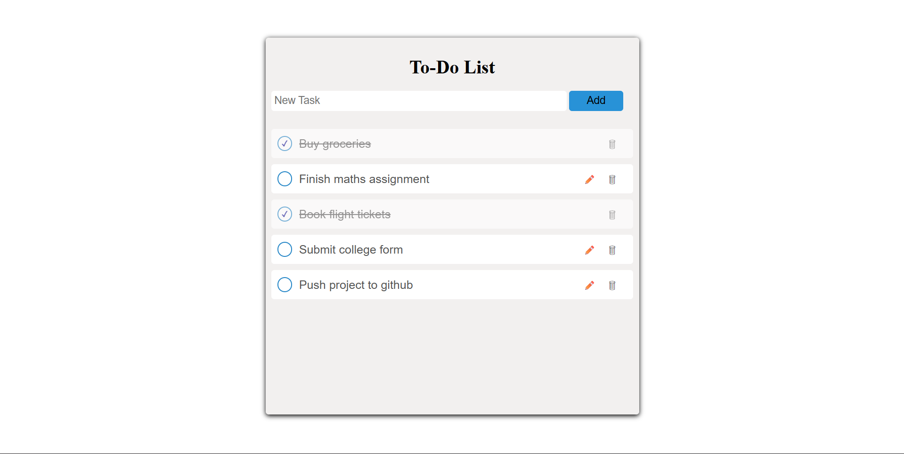

_Main App View_


_Edit Mode_


# To-Do List App

A simple full stack To-Do application that lets users add, edit, complete and delete tasks.  
This project focuses on clean UI behavior, proper form handling and backend integration.

## Features

- Add new tasks
- Edit tasks directly in the list
- Save edits using the Enter key
- Mark tasks as completed
- Delete tasks

## Tech Stack

- HTML, CSS, JavaScript
- EJS
- Node.js
- Express
- MongoDB (Mongoose)

## How to Run Locally

1. Clone the repository
```
git clone https://github.com/mharshil1234/to-do-app.git
```

2. Install dependencies
```
npm install
```

3. Make sure MongoDB is running

4. Start the server
```
npm start
```

5. Open the app in your browser
```
http://localhost:5000
```

## Author

Harshil Maheshwari
